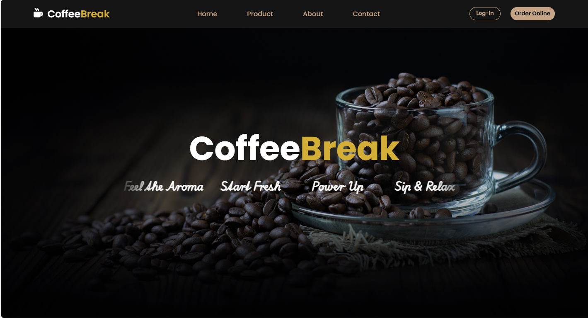

# CoffeeBreak

Um site de cafeteria responsivo desenvolvido com HTML, CSS e JAVASCRIPT

---

## Tecnologias

- HTML
- CSS
- JAVASCRIPT

## Responsividade 

- Menu responsivo
- Sistema de favoritos
- Feedback visual ao favoritar
- Navegação intuitiva

## Responsividade

Projeto adaptado para:
- Celulares
- Tablets
- Computadores

## Preview

## Como Executar o Projeto 

1. Clone o Repositório

Bash

git clone LINK_DO_REPOSITORIO
